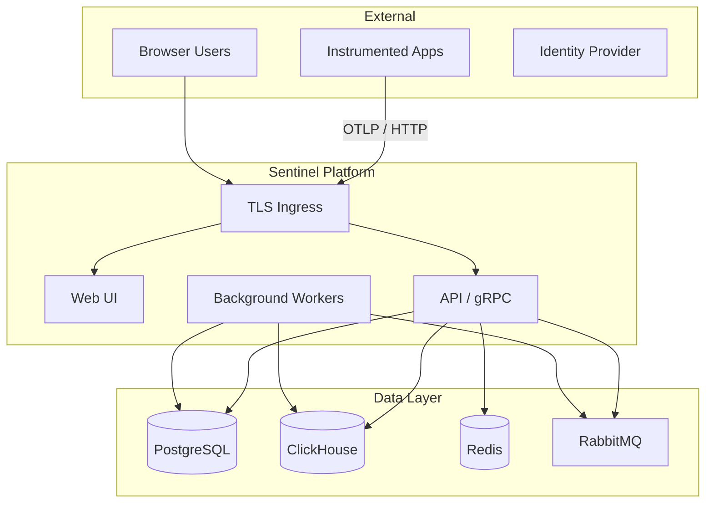

# Sentinel Threat Model

## Overview

Sentinel is a multi-tenant observability platform that ingests logs, metrics, and traces, stores them in PostgreSQL and ClickHouse, and exposes search, alerting, and AI-assisted analysis through a web UI and REST/gRPC APIs.

## System Context

## Assets

| Asset | Classification | Impact if Compromised |
|-------|---------------|----------------------|
| JWT signing keys | Critical | Full account impersonation |
| Tenant telemetry data | High | Data breach, compliance violation |
| PostgreSQL (identity, config) | Critical | Auth bypass, privilege escalation |
| ClickHouse (logs/metrics/traces) | High | Historical data exposure |
| AI provider API keys | High | Cost abuse, data exfiltration via prompts |
| RabbitMQ queues | Medium | Message tampering, denial of service |

## Trust Boundaries

1. **Internet → Ingress**: Untrusted; TLS termination, WAF recommended.
2. **Ingress → Platform pods**: Semi-trusted; network policies restrict lateral movement.
3. **Platform → Data layer**: Trusted internal network; credentials via Kubernetes secrets.
4. **Tenant isolation**: Enforced at API layer via JWT `tenant_id` claim and repository filters.

## Threat Actors

| Actor | Motivation | Capability |
|-------|-----------|------------|
| External attacker | Data theft, service disruption | Network access, credential stuffing |
| Malicious tenant | Cross-tenant data access | Valid API credentials |
| Insider (operator) | Data exfiltration | Cluster admin access |
| Compromised dependency | Supply chain attack | Build pipeline access |

## STRIDE Analysis

### Spoofing
- **Threat**: Stolen JWT or API keys used to impersonate users.
- **Mitigation**: Short-lived access tokens, refresh token rotation, bcrypt password hashing, HTTPS only.

### Tampering
- **Threat**: Log injection or alert rule manipulation.
- **Mitigation**: Input validation (FluentValidation), RBAC on write endpoints, audit logging.

### Repudiation
- **Threat**: User denies creating alert rules or API keys.
- **Mitigation**: Audit service records identity actions in PostgreSQL.

### Information Disclosure
- **Threat**: Cross-tenant log leakage; secrets in AI prompts.
- **Mitigation**: Tenant-scoped queries, `SecretRedactor` before AI calls, encryption at rest (operator responsibility).

### Denial of Service
- **Threat**: High-volume log ingestion overwhelms API or ClickHouse.
- **Mitigation**: Rate limiting (ingress), HPA autoscaling, RabbitMQ backpressure, resource limits.

### Elevation of Privilege
- **Threat**: Viewer role gains admin permissions.
- **Mitigation**: RBAC service with role-permission mapping, server-side authorization checks.

## Attack Surfaces

1. **Public API** (`/api/v1/*`) — authentication required except log ingestion (tenant header/key).
2. **gRPC ingestion** — OTLP-compatible endpoints.
3. **SignalR hubs** (`/hubs/*`) — JWT via query string.
4. **Web UI** — XSS/CSRF vectors; CSP headers recommended.
5. **Admin operations** — tenant/user management endpoints.
6. **Kubernetes control plane** — Helm values, secrets management.

## Residual Risks

| Risk | Severity | Acceptance Criteria |
|------|----------|---------------------|
| OpenTelemetry dependency advisories (NU1902) | Medium | Audit level set to high; upgrade when patched |
| Anonymous log ingestion endpoint | Medium | Require tenant API key in production |
| Single-region deployment | Medium | Document DR procedures; multi-region is future work |

## Security Controls Checklist

- [ ] Rotate JWT secret on every major release
- [ ] Enable TLS ingress with cert-manager
- [ ] Use external secrets operator for production credentials
- [ ] Enable network policies (`networkPolicy.enabled: true`)
- [ ] Restrict RabbitMQ management port to internal networks
- [ ] Run periodic k6 load tests and review SLO breaches
- [ ] Complete OWASP ASVS checklist before production go-live
